<div align="center">



<br><br>


<br>

<p>
  
  
  
</p>

</div>

<br>

## About

I'm **Hugo** — software engineer and product builder shipping under the **NovaDev** banner.

I design and build **end-to-end products**: from the pixel-perfect landing and animated UI, through the API and database, all the way to automations, integrations and the infra that keeps it running at 3AM.

I don't just hand over code. I ship things people actually use — **fast, polished, and built to scale**.

> *"The difference between a good product and a great one lives in the details. I live for those details."*

<br>

## What I build

<table>
<tr>
<td width="33%" valign="top">

### Web products
High-conversion landings, SaaS dashboards, marketing sites. **Next.js**, animated, server-rendered, Lighthouse 95+.

</td>
<td width="33%" valign="top">

### Backend & automation
REST & serverless APIs, email automation pipelines, scrapers, CRMs and internal tools. Built for **reliability, not just the demo**.

</td>
<td width="33%" valign="top">

### Full products
From "I have an idea" to a live, paying product — design, frontend, backend, deploy, iterate. One builder, full stack.

</td>
</tr>
</table>

<br>

## Stack

**Frontend** &nbsp;


**Backend** &nbsp;


**Cloud & ops** &nbsp;


**Craft & AI** &nbsp;


<br>

## Currently in orbit

<table>
<tr>
<td width="50%" valign="top">

### 🛰️ Nebula · Cortex
**A second brain for students.**
Capture, connect, and actually *remember* what you learn. Built to make studying feel less like work and more like leveling up.

`Next.js` · `TypeScript` · `Supabase` · `Framer Motion`

[`→ enter orbit`](https://github.com/socialgrowthh/nebula-cortex)

</td>
<td width="50%" valign="top">

### ✉️ Lead Engine
**Email automation that actually converts.**
Outreach pipelines, warm-up, inbox placement and analytics — built for teams that need leads, not spam.

`Python` · `FastAPI` · `PostgreSQL` · `Next.js`

[`→ enter orbit`](#)

</td>
</tr>
<tr>
<td width="50%" valign="top">

### 🌌 Nova · Agency
**Premium web design, built like software.**
Landings engineered to load fast, convert high, and feel alive. Every pixel earns its place.

`Next.js 16` · `Tailwind 4` · `Framer Motion`

[`→ enter orbit`](https://github.com/socialgrowthh/nova-landing)

</td>
<td width="50%" valign="top">

### 🧪 Void Workspace
**My lab.**
Where I prototype, break things, and turn ideas into products. If you see weird commits here — something is cooking.

`TypeScript`

[`→ enter orbit`](https://github.com/socialgrowthh/void-workspace)

</td>
</tr>
</table>

<br>

## Telemetry

<div align="center">


<br>


<br><br>


</div>

<br>

## Flight log

```yaml
identity:     Hugo · socialgrowthh
role:         Software engineer · product builder
universe:     NovaDev
specialty:    end-to-end web products (design → deploy)
experience:   1,300,000+ seconds in the craft
currently:    building Nebula · Cortex
mode:         deep work
availability: open to collaborations, freelance and wild ideas
```

<br>

## Let's build something

If you have a product, an idea, or a problem that deserves great software —
**I'm the builder you send it to.**

<p>
  <a href="https://github.com/socialgrowthh"></a>
</p>

<div align="center">

<br>

<sub><i>the nebula is always expanding · new orbits incoming</i></sub>

</div>
