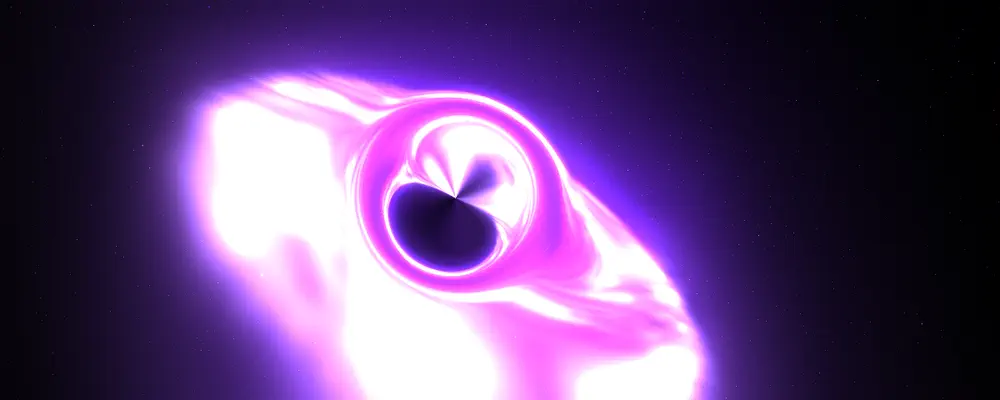
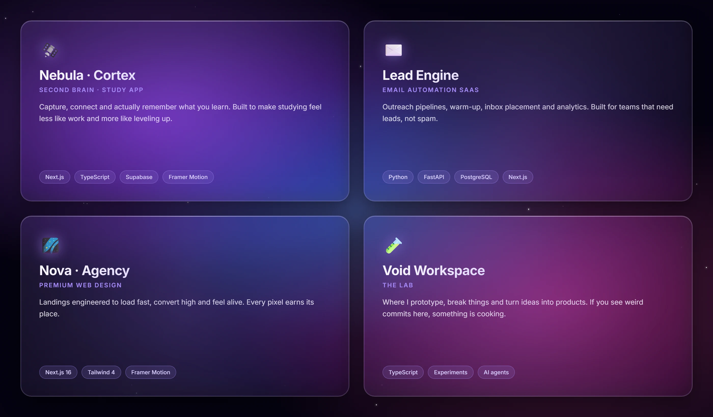

<div align="center">



<br><br>


<br>

<p>
  
  
  
</p>

</div>

<br>

## About

I'm **Hugo** — software engineer and product builder shipping under the **NovaDev** banner.

I design and build **end-to-end products**: from the pixel-perfect landing and animated UI, through the API and database, all the way to AI agents, automations and the infra that keeps it running at 3AM.

I don't just hand over code. I ship things people actually use — **fast, polished, and built to scale.**

> *"The difference between a good product and a great one lives in the details. I live for those details."*

<br>

## What I build

<table>
<tr>
<td width="33%" valign="top">

### 🌐 Web products
High-conversion landings, SaaS dashboards, marketing sites. **Next.js**, animated, server-rendered, Lighthouse 95+.

</td>
<td width="33%" valign="top">

### ⚙️ Backend & automation
REST & serverless APIs, email automation pipelines, scrapers, CRMs and internal tools. Built for **reliability, not just the demo.**

</td>
<td width="33%" valign="top">

### 🤖 AI & agents
LLM-powered features, custom agents, RAG pipelines and Claude Code workflows that turn hours of work into seconds.

</td>
</tr>
</table>

<br>

## Stack

**Frontend** &nbsp;


**Backend** &nbsp;


**AI & agents** &nbsp;


**Cloud & ops** &nbsp;


**Craft** &nbsp;


<br>

## Currently in orbit

<div align="center">



</div>

<br>

## Snake eating my contributions

<div align="center">


</div>

<br>

## Telemetry

<div align="center">


<br>


<br><br>


</div>

<br>

## Flight log

```yaml
identity:     Hugo · socialgrowthh
role:         Software engineer · product builder · AI tinkerer
universe:     NovaDev
specialty:    end-to-end web products (design → deploy → agents)
experience:   1,300,000+ seconds in the craft
currently:    building Nebula · Cortex
mode:         deep work
availability: open to collaborations, freelance and wild ideas
```

<br>

## Let's build something

If you have a product, an idea, or a problem that deserves great software —
**I'm the builder you send it to.**

<p>
  <a href="https://github.com/socialgrowthh"></a>
</p>

<div align="center">

<br>

<sub><i>the nebula is always expanding · new orbits incoming</i></sub>

</div>
